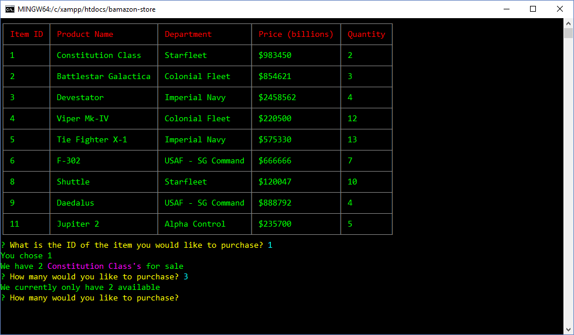

# Bamazon

A Node.js / MySQL Amazon-like app

## :computer: Technologies Used 
 
* Node.js
* MySQL
* JavaScript
* Node Modules
	* Inquier
	* CLI-table
	* Accounting
    * Colors 

## :dvd: Installation and Usage 

* Copy the MySQL script in the bamazondb.sql file to MySQL Workbench and run the script
* This will create the bamazon database and tables needed to run the modules

## :boom: Features

* bamazonCustomer will display a table of products and allow user to purchase products and provides an invoice.
* bamazonManager will display products, low inventory items, restock inventory and create new products.
* bamazonExecutive will display department sales and gross profit as well as creating new departments.

---:

## :bust_in_silhouette:

* Rich Cross 

___:

## :tv:

### Customer Screens
Display Products

Purchase Confirmed

Validation

Purchase Invoice

### Manager Screens
View Products

Low Inventory

Restock

### Executive Screens

Department View

